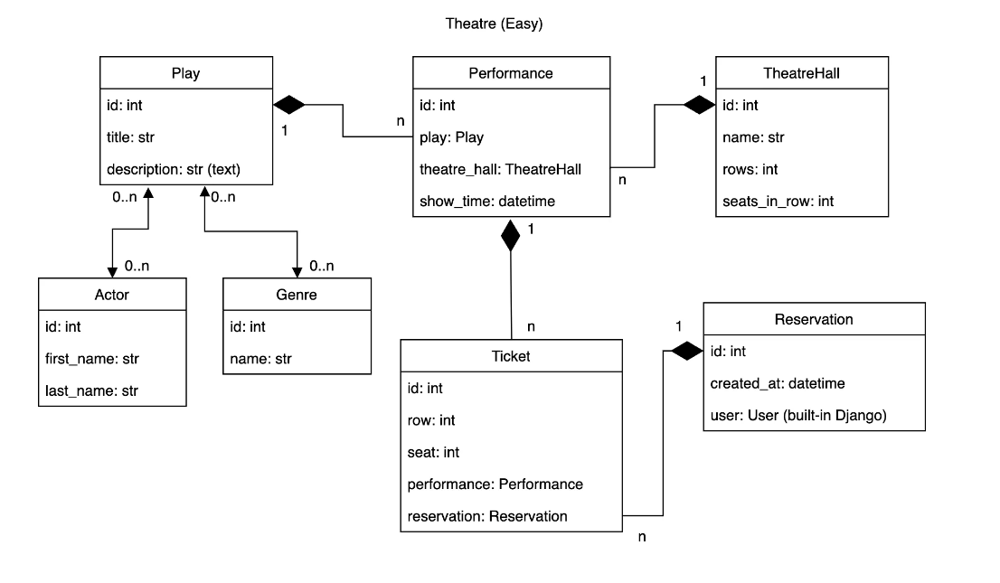
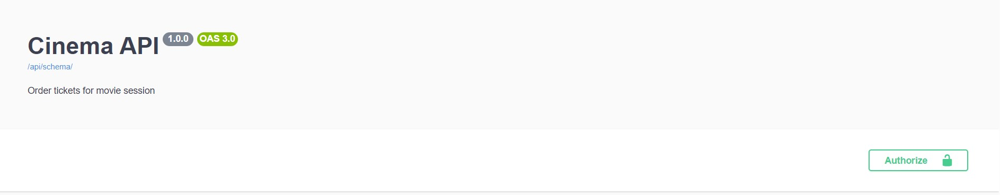
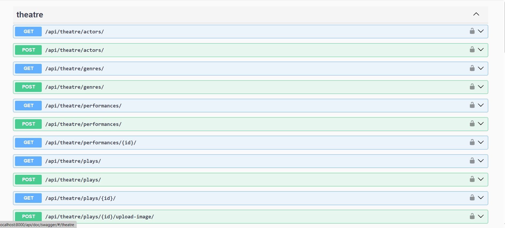
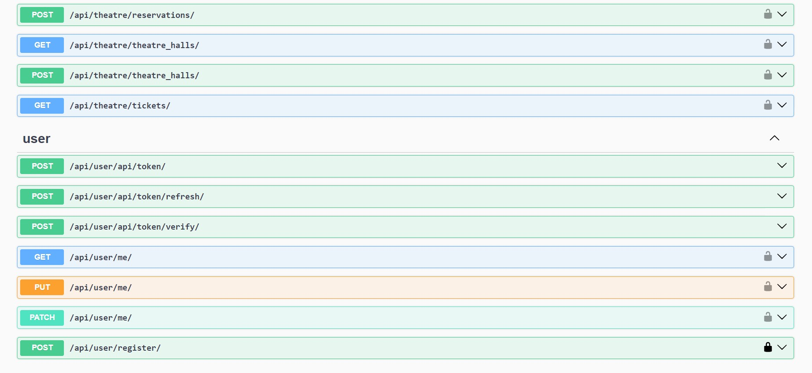
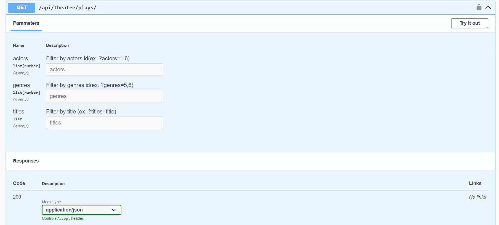

# Theatre API

Welcome to the Theatre API! 
This API is a Django-based web application designed to manage theatrical performances, theatre sessions, reservations, and related data for a theatre. It provides various endpoints for administrators and authenticated users to interact with the system, offering features such as viewing and filtering performances, managing show sessions, creating reservations, and more.

## DB Structured



## Getting Started
Before you begin, make sure you have the following tools and technologies installed:

- Python (>=3.6)
- Django
- Django REST framework

## Installing/GitHub

```
git clone https://github.com/Evheniia96/theatre-api
python3 -m venv venv
venv\Scripts\activate (on Windows)
source venv/bin/activate (on macOS)
pip install -r requirements.txt
```

## Installing/DockerHub

Login into the Docker:
```
docker login
```
Pull the project:

```angular2html
docker pull evgeniiailchenko/docker-theatre
```


## .env file
Open file .env.sample and change environment variables to yours. Also rename file extension to .env

## Run on local server
- Install PostgreSQL, create DB and User
- Connect DB
- Run:
```
python manage.py migrate
python manage.py runserver
```
## Run with Docker
Docker should be already installed

```
docker-compose up --build
```

## Create/Authenticate User
- Path to create user: api/users
- Path to login user: api/users/token
- Authorize Bearer
- docker ps
- docker exec -it theatre bash
- python manage.py createsuperuser

## Getting access
You can use following:

superuser:
- Email: admin@gmail.com
- Password: 1qazcde3

### Note: Make sure to send Token in api urls in Headers as follows
```
key: Authorize
value: Bearer <token>
```
## Stop server
```docker-compose down```

## API Endpoints
<details>
  <summary>Plays</summary>

- **List Plays**: `GET /api/theatre/plays/`
- **Create Plays**: `POST /api/theatre/plays/`
- **Retrieve Plays**: `GET /api/theatre/plays/{play_id}/`
- **Update Plays**: `PUT /api/theatre/plays/{play_id}/`
- **Partial Update** `PATCH /api/theatre/plays/{play_id}/`
- **Delete Plays**: `DELETE /api/theatre/plays/{play_id}/`
</details>

<details>
  <summary>Performances</summary>
  
- **List Performances**: `GET /api/theatre/performances/`
- **Create Performances**: `POST /api/theatre/performances/`
- **Retrieve Performances**: `GET /api/theatre/performances/{performance_id}/`
- **Update Performances**: `PUT /api/theatre/performances/{performance_id}/`
- **Partial Update** `PATCH /api/theatre/performances/{performance_id}/`
- **Delete Performances**: `DELETE /api/theatre/performances/{performance_id}/`
</details>

<details>
  <summary>Reservations</summary>
  
- **List Reservations**: `GET /api/theatre/reservations/`
- **Create Reservation**: `POST /api/theatre/reservations/`
- **Retrieve Reservation**: `GET /api/theatre/reservations/{reservation_id}/`
- **Update Reservation**: `PUT /api/theatre/reservations/{reservation_id}/`
- **Partial Update** `PATCH /api/theatre/reservations/{reservation_id}/`
- **Delete Reservation**: `DELETE /api/theatre/reservations/{reservation_id}/`
</details>

<details>
  <summary>Actors</summary>
  
- **List Actors**: `GET /api/theatre/actors/`
- **Create Actor**: `POST /api/theatre/actors/`
- **Retrieve Actor**: `GET /api/theatre/actors/{actor_id}/`
- **Update Actor**: `PUT /api/theatre/actors/{actor_id}/`
- **Partial Update** `PATCH /api/theatre/actors/{actor_id}/`
- **Delete Actor**: `DELETE /api/theatre/actors/{actor_id}/`
</details>

<details>
  <summary>Genres</summary>
  
- **List Genres**: `GET /api/theatre/genres/`
- **Create Genre**: `POST /api/theatre/genres/`
- **Retrieve Genre**: `GET /api/theatre/genres/{genre_id}/`
- **Update Genre**: `PUT /api/theatre/genres/{genre_id}/`
- **Partial Update** `PATCH /api/theatre/genres/{genre_id}/`
- **Delete Genre**: `DELETE /api/theatre/genres/{genre_id}/`
</details>

<details>
  <summary>Theathe halls</summary>
  
- **List Theathe halls**: `GET /api/planetarium/theatres/`
- **Create Theathe hall**: `POST /api/planetarium/theatres/`
- **Retrieve Theathe hall**: `GET /api/planetarium/theatres/{theatre_id}/`
- **Update Theathe hall**: `PUT /api/planetarium/theatres/{theatre_id}/`
- **Partial Update** `PATCH /api/planetarium/theatres/{theatre_id}/`
- **Delete Theathe hall**: `DELETE /api/planetarium/theatres/{theatre_id}/`
</details>

## Documentation
- The API is documented using the OpenAPI standard.
- Access the API documentation by running the server and navigating to http://localhost:8000/api/doc/swagger/ or http://localhost:8000/api/doc/redoc/.




